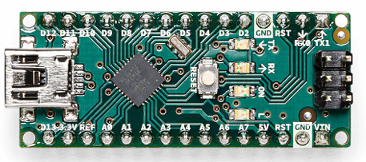
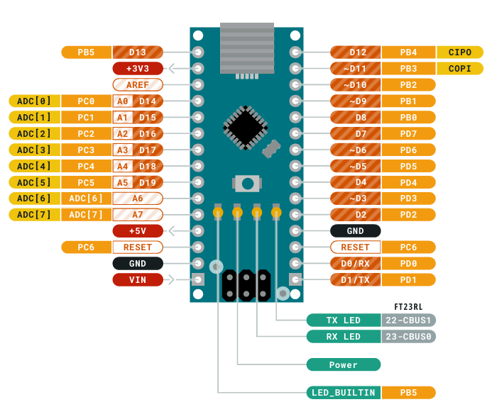
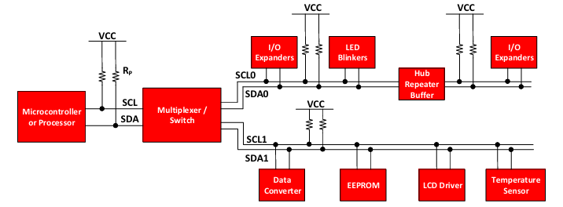
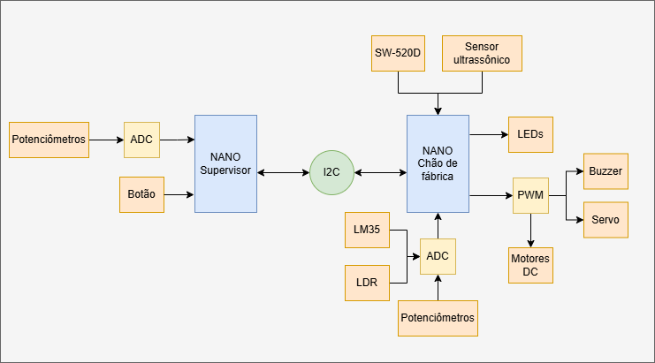
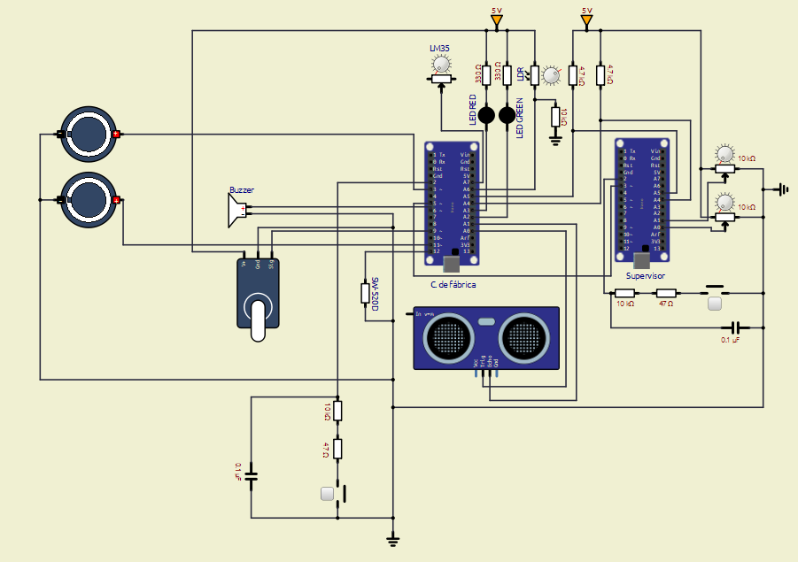

<h1 align="center"><i>Sistema Integrado de Produção</i></h1>

<h3 align="center">Sistema embarcado para automação de uma planta industrial</h3>

O Sistema Integrado de Produção monitora a produção de blocos de madeira via Arduino Nano, integrando sensores e atuadores
de segurança para garantir uma operação segura e precisa.

<h4 align="center">

</h4>

## Sobre o projeto

Este sistema monitora uma linha de fabricação de blocos de madeira e é dividido em duas entidades: Supervisor e o Chão de fábrica. O Chão de Fábrica, atuando como encarregado, gerencia 
diretamente a linha de produção por meio de seus sensores e atuadores. Parâmetros críticos como temperatura, inclinação, presença humana e nível de óleo do tanque são monitorados continuamente para garantir uma produção segura. 

Por sua vez, o Supervisor possui total controle sobre a velocidade dos motores operados pelo Chão de Fábrica, podendo ainda efetuar paradas emergenciais na produção quando necessário. 
Ambas as entidades foram implementada com a plataforma Arduino Nano e se comunicam através do protocolo I2C (o que promove integração ao sistema).

  

    <h4> ⚙️ Componentes eletrônicos utilizados </h4>  

  
- 2 potênciometros de 10K;
- 2 _pushbuttons_;
- 1 sensor de temperatura LM35;
- 1 buzzer passivo
- 1 LED verde;
- 1 LED vermelho;
- 1 sensor de inclinação SW-520D;
- 1 servo motor;
- 2 motores CC;
- 2 displays de 7 segmentos;
- 1 LDR;
- 1 sensor ultrassônico HC-SR04;

  
 
    <h4> ✔️ Funcionalidades </h4>

  #### Supervisor
  - Botão de parada: interrupção e/ou retomada da produção a qualquer momento;
  - Controle da velocidade dos motores por meio de potenciômetros;
  - (**NÃO FUNCIONAL**) Atualização periódica do status da produção via monitor serial: a cada 3 segundos, as seguintes informações são exibidas no monitor
      - Status do Sensor de Temperatura
      - Status do Sensor de Inclinação
      - Status do Sensor de Presença
      - Status do Nível Tanque de Óleo
      - Status da produção
      - Velocidade dos motores
      - Quantidade de blocos cortados
  
  #### Chão de fábrica
  - Botão de parada: interrupção e/ou retomada da produção a qualquer momento;
  - Controle de motores CC para cortes verticais e horizontais (100 rotações = 5cm de madeira cortados);
  - Corte de blocos de madeira no tamanho 10cm x 25cm;
  - Contagem da quantidade de blocos cortados (**NÃO FUNCIONAL**);
  - Monitoramento da temperatura do sistema: faixa de operação 10°C a 40°C;
  - Monitoramento da orientação da madeira;
  - Monitoramento da prensença humana em torno da esteira;
  - Monitoramento do nível de óleo no tanque;
  - Notificação no monitor serial em caso de erros;
  - Notificação do supervisor via I2C em caso de erro.

  A descrição completa dos requisitos funcionais do sistema pode ser encontrada [aqui](https://github.com/camilaqPereira/se-planta-industrial/blob/f7c380d73aa0089b55bcd2929ed84c8df9953db7/docs/problema2-planta-industrial.pdf).

## Softwares utilizados

<b>Linguagem C</b>

### Linguagem C

É uma linguagem de programação de propósito geral que combina abstrações e controles de baixo nível sobre o hardware resultando em ganho de eficiência. O software criado em 1970 por 
Dennis Ritchie é estreitamente associada ao sistema operacional UNIX, uma vez que as versões desse sistema foram escritas em linguagem C. Além disso, a sintaxe simples e a alta 
portabilidade desta linguagem entre dispositivos contribui para seu amplo uso em sistemas embarcados de recursos limitados.

<b>Arduino IDE</b>

### Arduino IDE
O [Arduino IDE](https://docs.arduino.cc/software/ide/) é um software de código aberto destinado a implementação, compilação e _upload_ de códigos em placas Arduino. Esta plataforma disponibiliza uma ampla
biblioteca de funções pré-definidas que simplificam o desenvolvimento de projetos, tornando-o ideal para iniciantes e desenvolvedores experientes experientes.

<b>Wokwi</b>

### Wokwi
O [Wokwi](https://wokwi.com/) é um simulador de eletrônica online que permite projetar, testar e depurar projetos de hardware e software em um ambiente virtual. Este simulador disponiliza
placas populares como Raspberry Pi Pico/W, Arduino e ESP32, além componentes eletrônicos e recursos avançados como analisador lógico e simulação de Wifi.

## Arduino Nano

<b>Visão geral do Arduino Nano</b>

### Visão geral do Arduino Nano

Baseado no microcontrolador ATMega328p, o Arduino Nano (Figura 1) é uma placa de desenvolvimento compacta, versátil e compatível com prototipação em protoboards. Dentre suas 
características, destacam-se:
- clock de 16MHz;
- 14 pinos digitais de entrada e saída;
- 6 saídas PWM;
- 8 saídas analógicas;
- Comunicação serial, SPI e I2C;
- Processador de 8 bits;
- 32 registradores de propósito geral de 8 bits.

As informações de configuração dos registradores pode ser encontrada no [datasheet do microcontrolador ATMega328p](https://www.alldatasheet.com/datasheet-pdf/view/1425005/MICROCHIP/ATMEGA328P.html)

  <figure>  
    
    <figcaption>
      
 

[**Figura 1** - Arduino Nano](https://docs.arduino.cc/hardware/nano/)

    </figcaption>
  </figure>

<b>Diagrama de pinos do Arduino Nano</b>

### Diagrama de pinos do Arduino Nano

Figura 2 apresenta o diagrama de pinos do Arduino Nano.

  <figure>  
    
    <figcaption>
      
 

[**Figura 2** - Diagrama de pinos do Arduino Nano](https://docs.arduino.cc/hardware/nano/)

    </figcaption>
  </figure>

### 📖 Review de periféricos no ATMega328/p

<b>Portas de entrada e saída</b>

### Portas de entrada e saída

O ATMega328/p possui três conjuntos de portas I/O: PORTB (PB7, ..., PB0), PORTC (PC7, ..., PC0) e PORTD (PD7, ..., PD0). Cada um destes pinos podem ser lidos, modificados ou escritos individualmente. Os registradores para controle das portas de entrada e saída são:
- PORTx: registrador de dados usado para escrita nos pinos;
- DDRx: registrador de direção usado para definir a direção dos pinos (entrada ou saída);
- PINx: registrador de entrada usado leitura do conteúdo dos pinos.

> _NOTE_
>
> Todos os pinos do ATMega328/p possuem resistores _pull up_ internos, além de diodos de proteção entre o Vcc e o ground e uma capacitância de 10 pF.

<b>Interrupções</b>

### Interrupções
As interrupções no ATMega328p são:

- _vetoradas_: as rotinas de tratamento das interrupções possuem endereço fixo;

- _mascaráveis_: podem ser habilitadas individualmente;

- desabilitadas durante a execução da rotina de tratamento de uma interrupção disparada anterior.

Todos os pinos podem gerar interrupções por mudança de nível lógico (PCINT0...23). No entanto, apenas os pinos INT0 e INT1 geram interrupções externas para
nível lógico baixo, nível lógico alto, mudança de nível lógico, borda de descida ou borda de subida.

> _NOTE_
>
> O ATMega328/p possui um bit de controle para habilitação de todas as interrupções: bit 1 do SREG.

<b>Timers de hardware</b>

### Timers de hardware

O microcontrolador ATMega328/p é equipado com três temporizadores de hardware: TIMER0, TIMER1 E TIMER2. Estes timers são amplamente empregados em contagens 
simples, contagens de eventos externos, geração de sinais PWM (2 canais por timer) e geração de frequência. Cada um dos contadores possui um divisor de clock de até
10 bits, permitindo um controle preciso das temporizações.

TIMER0 e TIMER2 são temporizadores de 8 bits que apresentam quatro modos de operação. São eles:
- Modo nomal: o temporizador conta continuamente de forma crescente de 0 a 255;
- Modo CTC (_clear timer on compare_): o temporizador é zerado quando o contador atinge o valor TOP configurado (OCRxA);
- Modo PWM rápido: geração de um sinal PWM de alta frequência. O timer conta de 0 a TOP. A saída pode ser não-invertida (OCxA limpo na igualdade de comparação) ou invertida (OCxA
ativo na igualdade de comparação);
- Modo PWM com fase corrigida: permite o ajuste da fase do sinal PWM. Baseia-se na contagem crescente e decrescente do contador, e é mais lento e preciso que o modo PWM rápido.

TIMER1 é um temporizador de 16 bits que permite a utilização tanto de um clock interno como de um clock externo para a contagem. Além dos modos de operação já citados, TIMER1 pode operar também no modo PWM com correção de fase e frequência. Neste modo, o pulso sempre é simétrico ao ponto médio do período.

> _NOTE_
>
> O TIMER2 permite o uso de um clock independente (externo) para a contagem precisa de 1s. 

<b>Conversor analógico digital</b>

### Conversor analógico digital

Os valores analógicos são grandezas que variam continuamente dentro de um intervalo. Para realizar o processamento destas grandezas em sistemas digitais, é necessário mapear o valor 
analógico real para um valor discreto com resolução compatível com o microcontrolador usado. Este mapeamento ocorre por meio da amostragem e quantização do sinal analógico. Neste 
contexto, os conversores AD são utilizados para conversão das grandezas analógicas. 

No ATMega328p, o ADC apresenta uma resolução de 10 bits e um tempo de conversão de 13 a 260 us. Este periférico integra seis canais multiplexados, permitindo a leitura de diferentes entradas analógicas. Além disso,  ADC opera em dois modos distintos: modo simples para conversões únicas ou modo contínuo para leitura constante de dados.

<b>Protocolo de comunicação I2C</b>

### Protocolo de comunicação I2C

O protocolo I2C permite a comunicação entre mestres e escravos por meio de dois barramentos: barramento de dados serial (SDA) que transporta endereços, dados e controle; e o barramento 
de clock serial (SCL) que sicroniza o transmissor e receptor durante a comunicação. 

Os dispositivos são classificados em mestres ou escravos. Os mestres geram os sinais de clock e iniciam a transmissão. Por sua vez, os escravos recebem e executam os comandos dos escravos. Cada escravo possui um endereço de identificação. Figura 3 apresenta um exemplo de uma interface I2C em um sistema embarcado.

  <figure>  
    
    <figcaption>
      
 

[**Figura 3** -Exemplo de barramento I2C em um sistema embarcado](https://www.ti.com/lit/an/slva704/slva704.pdf)

    </figcaption>
  </figure>

No microcontrolador ATMega328/p, a interface I2C, chamada de TWI (_Two Wire Serial Interface_), utiliza um endereçamento de 7 bits e suporta uma velocidade de até 400 kHz na transferência de dados. É fundamental que os pinos de SDA e SCL sejam conectados a resistores _pull up_ para garantr uma transmissão estável. 

> _TIP_
> 
> Para saber mais sobre o protocolo I2C acesse [Understanding I2C Bus | Texas Instruments](https://www.ti.com/lit/an/slva704/slva704.pdf).

## Solução proposta

  <figure>  
    
    <figcaption>
      
 

**Figura 4** - Diagrama da solução

    </figcaption>
  </figure>

  <figure>  
    
    <figcaption>
      
 

**Figura 5** - Esquemático do circuito montado

    </figcaption>
  </figure>

> _WARNING_
>
> Para controlar os motores CC, deve-se utilizar uma Ponte H (por exemplo, o módulo L298n). No esquemático da solução, este componente não foi adicionado para simplificar o circuito.
> Nos testes realizados, dois LEDs vermelhos foram utilizados para exibirem o sinal PWM transferido aos motores CC.

### Protocolo de comunicação

Neste projeto, a comunicação entre o supervisor (mestre) e o chão de fábrica (escravo) foi implementada por meio do protocolo I2C. Os pinos A4 (PC4) e A5 (PC5) foram configurados como SDA e SCL, respectivamente, e o endereço do chão de fábrica foi definido como 0x50. Para garantir o correto funcionamento dos barramentos de dados e de clock, adicionou-se resistores _pull up_ externos de 4.7kΩ.

A fim de otimizar a transmissão dos erros, implementou-se um padrão para o envio de dados. Neste padrão, o envio de dados do escravo ao mestre é realizado a partir de um frame de dados. Neste frame, cada bit representa uma flag de erro. Do MSB para o LSB, essas flags são:
- ERROR_STOP_REQUESTED: bit 7;
- ERROR_CRITICAL_TEMPERATURE: bit 6;
- ERROR_WRONG_INCLINATION: bit 5;
- ERROR_PRESENCE_DETECTED: bit 4;
- ERROR_TANK_EMPTY: bit 3;
- ERROR_TANK_FULL: bit 2.

Para permitir que o dispositivo escravo notifique o mestre sobre eventos, um pino digital do escravo foi conectado a um pino digital no mestre. Dessa forma, o escravo 
pode gerar uma interrupção no mestre sempre que necessite enviar uma notificação.

Por sua vez, o processo de envio de dados do metre ao escravo é feito por meio da transmissão sequencial de dois frames de dados. O primeiro contém a identificação do dado que será transmitido, enquanto o segundo contém o valor 
correspondente a este dado. Os valores das identificações e suas respectivas descrições são listadas a seguir:
- 0x01: nova velocidade do motor 1;
- 0x02: nova velocidade do motor 2;
- 0x03: pressionamento do botão de emergência;

### Configuração de periféricos

<b>Portas I/O</b>

#### Portas I/O

Tabela 1 e Tabela 2 listam, respectivamente, as portas I/O utilizadas (e suas configurações) pelo chão de fábrica e supervisor.

	
| Pino | Direção | Descrição |
| :---: | :---: | :---: |
| PD5 | Saída digital | Mestre: utilizado para solicitar ao mestre que inicie uma comunicação no modo leitura |
| PB3 | Saída PWM | Motor CC 1 |
| PD3 | Saída PWM | Motor CC 2 |
| A7 | Entrada analógica | LM35 |
| A6 | Entrada analógica | LDR |
| PC2 | Saída digital | Led verde |
| PC3 | Saída digital | Led vermelho |
| PD6 | Saída PWM | Buzzer passivo |
| PB4 | Entrada digital | SW-520D |
| PD2 | Entrada digital | Botão |
| PB1 | Saída PWM | Servo motor |
| PC0 | Saída digital | Trigger para HC-SR04 |
| PC1 | Entrada digital | Echo para HC-SR04 |

Tabela 1: Portas I/O usadas pelo chão de fábrica e suas respectivas configurações

	
| Pino | Direção | Descrição |
| :---: | :---: | :---: |
| A0 | Entrada analógica | Potênciometro |
| A1 | Entrada analógica | Potênciometro |
| PD2 | Entrada digital | Botão |

Tabela 2: Portas I/O usadas pelo supervisor e suas respectivas configurações

<b>Interrupções</b>

#### Interrupções
- Chão de fábrica:
	- INT0: utilizado para realizar a leitura do botão. Esta interrupção foi configurada para disparar na borda de descida;
	- TIMER2_OVF: a interrupção no estouro do timer 2 foi ativada para realizar a leitura multiplexada ADC e leitura do sensor SW-520D de forma periódica;
	- ADC: a leitura ADC por interrupção foi ativada. Os canais ADC usados no projeto são intercalados;
	- TWI: a comunicação TWI foi implementada por meio de interrupções.
- Supervisor:
  	- TIMER0_OVF: a interrupção no estouro do timer 0 foi ativada para realizar a leitura multiplexada ADC de forma periódica;
  	- INT0: utilizado para leitura do botão de emergência;
  	- INT1: utilizado para receber solicitação de transmissão de dados do escravo;
  	- ADC: a leitura ADC por interrupção foi ativada. Os canais ADC usadosno projeto são intercalados;
	- TWI: a comunicação TWI foi implementada por meio de interrupções.

<b>Timers</b>

#### Timers
- Chão de fábrica:
	- TIMER0: utilizado para o controle do buzzer passivo. Este timer foi configurado para o modo PWM rápido com prescaler igual a 8.
	- TIMER1: utilizado para o controle do servo motor e leitura do sensor ultrassônico. Este timer foi configurado para o modo PWM rápido com prescaler igual a 8. O ICR1 foi
 definido em 39999, produzindo um sinal com período de aproximadamente 20 ms. 
	- TIMER2: utilizado para o controle dos motores CC. Este timer foi configurado para o modoPWM com fase corrigida com prescaler de 8.
 - Supervisor:
   	- TIMER0: utilizado para as leituras ADC. Este temporizador foi configurado para o modo normal com prescaler de 1024.
   	- TIMER1: utilizado para as atualizações do status da produção. Este temporizador foi configurado para o modo CTC com prescaler de 1024. O TOP foi definido em 46874, gerando
um período de contagem de 3s (**NÃO FUNCIONAL**)

<b>Leituras ADC</b>

#### Leituras ADC

O ADC foi configurado para o modo contínuo com prescaler de 128 em ambas as entidades do projeto. O bit ADATE não foi ativado, pois mais de um canal do ADC foi utilizado. A sinalização para o início de uma nova conversão é realizada na ISR do estouro do timer 2 e timer 1, respectivamente, no chão de fábrica e no supervisor.

## Testes
